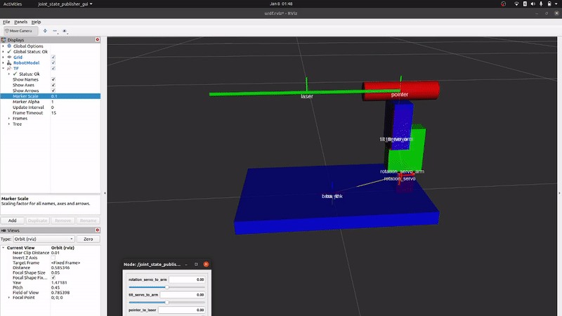

# Robo-Scarecrow
Team AVRP's HackED 2023 Project

## Description
Robo-Scarecrow is a bird-deterrance system built to track and target birds with a laser pointer or other method. It utilizes object detection using a ZED 2i and YOLOv7, and reverse kinematics to target the object given the 3d bounding box generated by the ZED.

### File Descriptions
- main.py: runs the camera and YOLO detection model to obtain 2d and 3d bounding boxes, communicates with servos and kinematics to move the bot
- filter.py: defines the algorithm to filter all of the detections to determine a target
- InverseKinematics.py: defines the inverse kinematic equations for the system
- servo.py: code to communicate with the servo motors via serial
- birdlaser.urdf: urdf file to describe system (servos, laser pointer, etc) to be used for inverse kinematics

